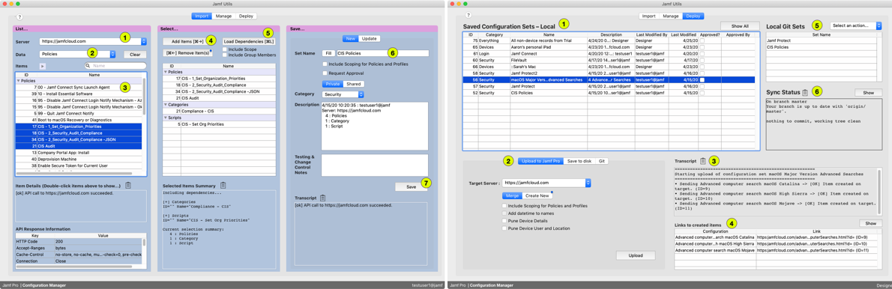
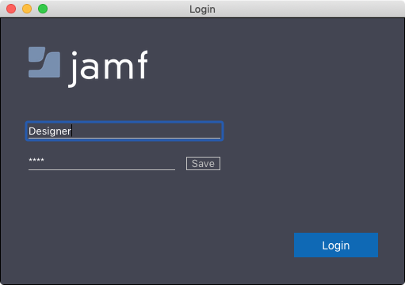
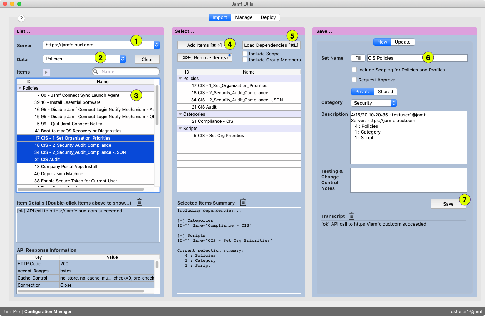
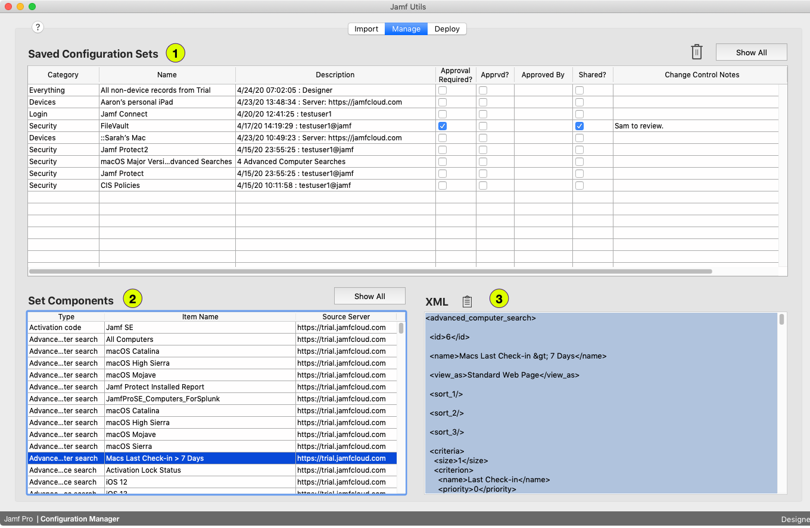
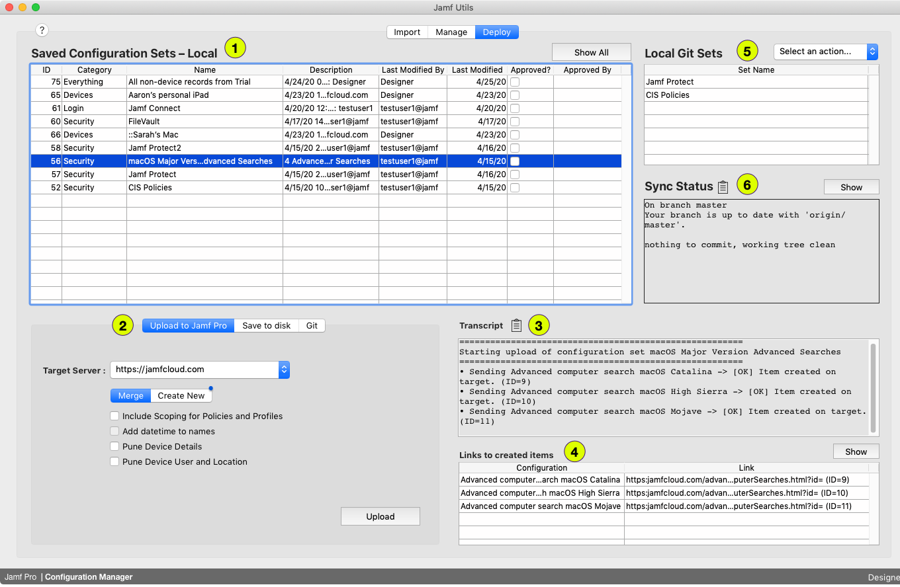
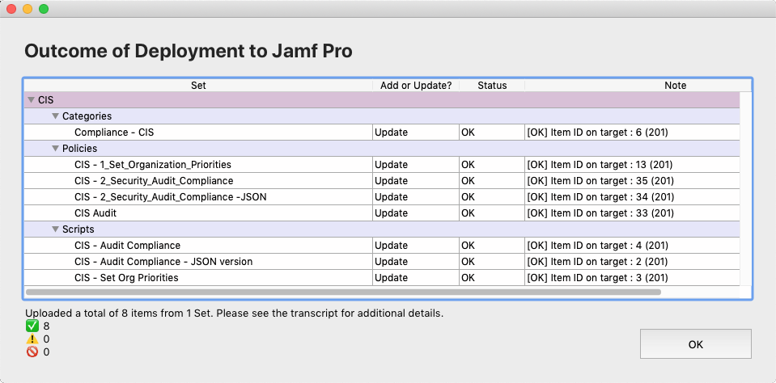

# Jamf Flow

## What is it? 
A database application that lets you:

* download devices and settings information via the Jamf Pro API
* group the data into configuration sets
* add descriptive information
* implement approval/change management workflows
* edit the data
* cross-reference the data to observe dependencies
* upload configurations sets to other Jamf Pro servers via API
* save and load configuration sets to git for version control, sharing, pull requests, etc. 

The intended use case is Jamf's who need to quickly configure instances to test and demo our solutions without having to do repetitive data entry. 
 
## These are not the droids you're looking for... 
This is beta software. Some things are only partly implemented and not tested in a wide variety of situations. **Never** use any API script or app with a production Jamf Pro instance unless you completely trust, understand, and test it extensively beforehand. API projects that write data using the Jamf Pro API make it single-click easy to break... everything. 

> Be careful! If you need to read data from a Jamf Pro instance that you do not intend to modify, _always_ use a read-only ("Auditor") user account. 

Better solution?

> If you're looking for a good/simple utility for moving device data in and out of Jamf Pro, take a look at the essential `https://jssmut.weebly.com/` and the full-featured `https://github.com/jamf/JamfMigrator` Jamf Pro instance data migration utility. `https://github.com/jacobschultz/scout-public` is a super-cool approach to data aggregation. These solutions handle the majority of what people need to do and have proven effective in real-world use. Plus they're actively maintained. The first two are native Swift and the latter is a standard web stack so they don't have any odd-ball dependencies. 

### License

This project uses functions that are covered under commercial and open-source agreements from Apple, Jamf, git, 4D, php, and the Apache xerces C++ XML parser. Licensing for any underlying software, operating systems, or utilities are available separately from their respective owners. Jamf Pro customers can use this project with their test instances but it's not a part of Jamf's product line and not covered under any support agreement. 

THE SOFTWARE IS PROVIDED "AS IS", WITHOUT WARRANTY OR SUPPORT OF ANY KIND, EXPRESS OR IMPLIED, INCLUDING BUT NOT LIMITED TO THE WARRANTIES OF MERCHANTABILITY, FITNESS FOR A PARTICULAR PURPOSE AND NON-INFRINGEMENT. IN NO EVENT SHALL THE AUTHORS OR COPYRIGHT HOLDERS BE LIABLE FOR ANY CLAIM, DAMAGES OR OTHER LIABILITY, WHETHER IN AN ACTION OF CONTRACT, TORT OR OTHERWISE, ARISING FROM, OUT OF OR IN CONNECTION WITH THE SOFTWARE OR THE USE OR OTHER DEALINGS IN THE SOFTWARE. 

## Quick Start

### Setting up

This project is a bundle folder that contains interface forms, code, and data. You need to install an application called "4D" to run it. 4D is a proprietary database application development environment that dates back to the early days of Mac. It has a steep learning curve and it's not as cheap and easy to deploy as as an opensource-based web or Swift app, but its tight integration of database and GUI allows very fast development of complex database apps. So if time is the limitting factor, as is the case with quick and dirty experiments like this one, it's perfect. 

To use this project, you'll need to sign up for a 4D trial account and then download a copy of 4D. You can use it in developer mode for 30 days. After that you can still use this project, but you'll need to purchase 4D if you want to make any changes to the underlying code or interface. 

1. Download the JamfProConfig.4dbase project file. You can put it in any writable folder. (Desktop, Documents, etc.)
2. Download a copy of 4D from https://us.4d.com/4d-free-trial
3. Run the 4D app. 
4. Click new user at the setup screen and enter your trial username and password. 
5. Open JamfFlow.4dbase

### Logging in

user=Designer / password=jamf

You can add other users for different sharing/approval permission levels if you wanted to implement those kinds of workflows. You can also configure for LDAP integration if you wanted to run this as a shared system within your organization. Click the Save button to add the login to your keychain and the login will be auto-populated the next time you need to log in. 

## The main screen

There are three tabs... 

1. Import : Load configurations from Jamf Pro
2. Manage : Edit configurations
3. Deploy : Push configurations to other Jamf Pro instances and interact with git

### Import

1. Pick a Jamf Pro server from the list. You won't have any to start... there's an option to add new servers. (Creds get stored in your keychain but be safe... don't put in a user with write permissions to a production Jamf Pro.)
2. Pick the kind of data you want to work with (devices, profiles, policies, settings, etc.)
3. Highlight some items
4. Add them to the selected configuration group items list. You can repeat the above steps as needed to add other kinds of Jamf Pro objects to the list, remove unwanted items, etc. 
5. If you want to add other required items (the packages that are needed for a policy, etc.), click the "Load Dependencies..." button
6. Enter a name for the configuration group
7. Click the save button. 

### Manage

Here you can view and edit

1. Configuration sets
2. Set components... individual records like devices, profiles, and policies

Interface:

* Highlight a configuration set to list its component items
* Click a component to display its XML
* Columns are resizable and sortable by clicking in the header
* Double-click an item to edit
* The trash-can button deletes an item from Jamf Flow's database... not from Jamf Pro
* The magnifying glass button above a text field opens the contents in your text editor

### Deploy

1. Highlight the configuration set(s) to deploy
2. Select the target type... you can push to Jamf Pro via API, save the xml files to disk, or push them to a local repo directory so you can manage them with your git app or command line, and/or sync to a git remote server (e.g. Github)
3. The transcript will show the operations log 
4. You can highlight a line in the created items list to open it if you want to inspect the results. 
5. The local git sets list shows any sets that have been saved to your local repo. The action menu lets you pull new configurations down from a shared git remote. You can then import these into the project database and edit/manage/deploy them just as you would if you pulled the configuration from an actual Jamf Pro server. 
6. Sync status will show the current state of your repo's commit log. Click the show button to refresh the display after you make manual changes. 

Post Jamf Pro-upload summary screen showing sets, object types, and objects with status. Note the good/warning/fail numbers at the bottom. 

